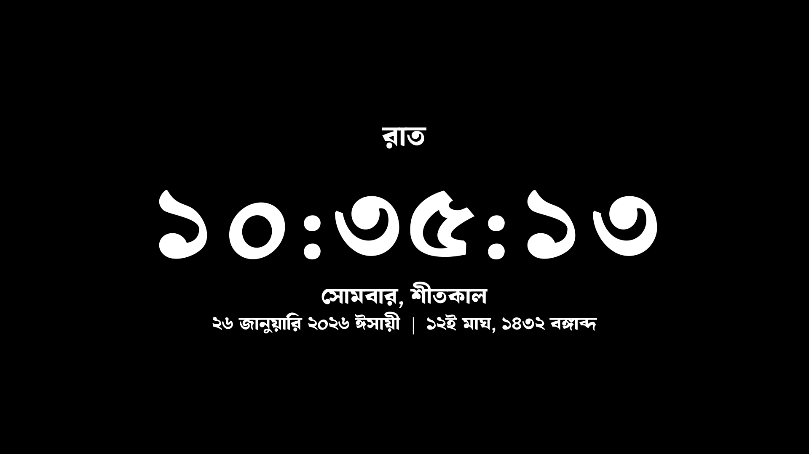

# বাংলা স্ক্রিনসেভার 🕐

A beautiful Bangla digital clock screensaver for Windows featuring the traditional Bengali calendar (বঙ্গাব্দ), Bangla numerals, and seasonal greetings.

<div align="center">


[](https://opensource.org/licenses/MIT)

</div>

---

## ✨ Features

- 🕐 **Bangla Digital Clock** – Displays time with elegant Bangla numerals (০১২৩৪৫৬৭৮৯)
- 📅 **Bengali Calendar** – Shows date in বঙ্গাব্দ with accurate day/month calculations
- 🌸 **Seasonal Display** – Shows the current Bengali season (ষড়ঋতু)
- 🇧🇩 **Regional Support** – Choose between Bangladesh and India calendar conventions
- ⏰ **Timezone Awareness** – Calculates Bengali date based on Bangladesh/India time, not local system time
- ⚙️ **Configurable** – Toggle seconds, 12/24h, Bangla numerals, date/day/season, font size, and colors
- 🖥️ **Launcher UI** – Native Win32 launcher (`BanglaSaver.exe`) to install, remove, preview, and configure
- 💨 **Lightweight** – Pure Rust, statically linked, no runtime dependencies (~2 MB)
- 🏪 **Microsoft Store** – Available on the [Microsoft Store](https://apps.microsoft.com/detail/9P9FB1WN7PCV)

---

## 📸 Preview



---

## 📥 Installation

### Option 1: Microsoft Store (Recommended)

Install from the [**Microsoft Store**](https://apps.microsoft.com/detail/9P9FB1WN7PCV) — automatic updates, no admin required.

### Option 2: Direct Download

1. Go to [**Releases**](https://github.com/abusayed0206/bsaver/releases)
2. Download `BanglaSaver.exe` and `bsaver.exe`
3. Place them in the same folder
4. Run `BanglaSaver.exe` → click **সেট করুন** (Set) → approve the UAC prompt
5. The launcher copies the screensaver to `System32` and activates it

### Option 3: Build from Source

**Prerequisites:** [Rust](https://rustup.rs/) (stable, 2024 edition) · Windows 10/11

```powershell
git clone https://github.com/abusayed0206/bsaver.git
cd bsaver
cargo build --release

# Two binaries are produced:
#   target\release\bsaver.exe      – the screensaver
#   target\release\BanglaSaver.exe – the launcher / installer UI
```

---

## 🚀 Usage

### Via the Launcher (BanglaSaver.exe)

The launcher provides a graphical interface with six actions:

| Button | Action |
|--------|--------|
| **সেট করুন** | Install screensaver to System32 and activate (UAC required) |
| **সরান** | Remove screensaver from System32 and deactivate (UAC required) |
| **প্রিভিউ দেখুন** | Preview the screensaver fullscreen |
| **ঘড়ি সেটিংস** | Open the clock configuration dialog |
| **স্ক্রিনসেভার সেটিংস** | Open Windows Screensaver Settings (`desk.cpl`) |
| **গিটহাব** | Open this repository in your browser |

### Via Command Line

```powershell
# Run screensaver fullscreen
bsaver.exe /s

# Open configuration dialog
bsaver.exe /c

# Preview in a parent window (used by Windows Settings)
bsaver.exe /p <hwnd>
```

### Configuration File

Settings are stored at:
```
%APPDATA%\abusayed\bsaver\config\config.json
```

**Example configuration (defaults):**
```json
{
  "show_seconds": true,
  "show_english_date": true,
  "show_bangla_date": true,
  "show_day": true,
  "show_time_period": true,
  "show_season": true,
  "use_bangla_numerals": true,
  "use_bangla_names": true,
  "use_12_hour": true,
  "calendar_region": "Bangladesh",
  "font_size": "Regular",
  "text_color": [255, 255, 255],
  "background_color": [0, 0, 0]
}
```

---

## 🌍 Calendar Region

Choose between **Bangladesh** and **India** calendar conventions:

| Setting | Pohela Boishakh | Timezone | Month lengths |
|---------|-----------------|----------|---------------|
| Bangladesh | April 14 | UTC+6 | Revised 2019 (first 5 months = 31 days) |
| India | April 15 | UTC+5:30 | Same structure |

The Bengali date is always calculated based on the selected region's timezone, not your local system time.

---

## 🎨 Customization

| Option | Description | Default |
|--------|-------------|---------|
| `show_seconds` | Display seconds in clock | `true` |
| `show_english_date` | Show Gregorian date | `true` |
| `show_bangla_date` | Show Bengali calendar date | `true` |
| `show_day` | Show day of week | `true` |
| `show_time_period` | Show সকাল/দুপুর/বিকাল/রাত | `true` |
| `show_season` | Show Bengali season (ঋতু) | `true` |
| `use_bangla_numerals` | Use ০১২৩৪৫৬৭৮৯ instead of 0123456789 | `true` |
| `use_bangla_names` | Use Bengali month/day names | `true` |
| `use_12_hour` | 12-hour format | `true` |
| `calendar_region` | `"Bangladesh"` or `"India"` | `"Bangladesh"` |
| `font_size` | `"Small"`, `"Regular"`, `"Larger"`, `"ExtraLarge"` | `"Regular"` |
| `text_color` | RGB color for text | `[255, 255, 255]` |
| `background_color` | RGB color for background | `[0, 0, 0]` |

---

## 🛠️ Development

### Build Commands

```powershell
cargo build                    # Dev build
cargo build --release          # Optimized release (~2 MB)
cargo test --verbose           # Run tests (calendar/timezone coverage)
cargo clippy -- -D warnings    # Lint (CI enforces zero warnings)
cargo fmt --all -- --check     # Format check
```

### Project Structure

```
bsaver/
├── src/
│   ├── main.rs          # Entry point — parses /s, /p, /c args
│   ├── screensaver.rs   # Win32 window, message loop, double-buffered GDI
│   ├── renderer.rs      # Text rendering with cosmic-text (Bangla shaping)
│   ├── clock.rs         # Time/date/day/season formatting
│   ├── bangla_date.rs   # Gregorian → Bengali calendar conversion
│   ├── config.rs        # Config struct with serde JSON serialization
│   ├── settings.rs      # Native Win32 settings dialog
│   └── launcher.rs      # BanglaSaver launcher UI (install/remove/preview)
├── font/
│   └── Ekush-Regular.ttf  # Embedded Bangla font
├── assets/
│   └── BanglaSaver.ico    # Application icon
├── packaging/
│   ├── AppxManifest.xml   # MSIX manifest
│   └── build-msix.ps1    # MSIX packaging script
├── build.rs               # Embeds icon as Win32 resource
├── Cargo.toml
└── .cargo/config.toml     # Static CRT linking
```

### Two Binaries

| Binary | Source | Purpose |
|--------|--------|---------|
| `bsaver` | `src/main.rs` | The screensaver itself (`.scr`) |
| `BanglaSaver` | `src/launcher.rs` | Launcher / installer UI |

### Key Design Decisions

- **Static CRT** (`+crt-static`) — eliminates `vcruntime140.dll` dependency for Store certification
- **Embedded font** — Ekush is loaded via `include_bytes!`, no system font enumeration
- **BGRA pixel buffer** — CPU-rendered to `Vec<u8>`, blitted via `SetDIBitsToDevice`
- **Registry via `reg.exe`** — bypasses MSIX registry virtualization so Windows screensaver service sees the changes
- **`SystemParametersInfoW`** — notifies Windows immediately after screensaver install/remove
- **No `static mut`** — Rust 2024 edition; uses `OnceLock`, `LazyLock`, `thread_local!` with `Cell`

---

## 📋 System Requirements

- **OS**: Windows 10/11
- **Display**: Any resolution (auto-scales)
- **Memory**: ~12 MB private working set at 1080p
- **Disk**: ~2 MB

---

## 🤝 Contributing

Contributions are welcome! Please feel free to submit a Pull Request.

1. Fork the repository
2. Create your feature branch (`git checkout -b feature/AmazingFeature`)
3. Commit your changes (`git commit -m 'Add some AmazingFeature'`)
4. Push to the branch (`git push origin feature/AmazingFeature`)
5. Open a Pull Request

---

## 📜 License

This project is licensed under the MIT License — see the [LICENSE](LICENSE) file for details.

---

## 🙏 Credits

- **Font**: [Ekush](https://codepotro.com/font/ekush/) by Code Potro

---

<div align="center">

**Made with ❤️ for the Bengali community**

[⭐ Star this project](https://github.com/abusayed0206/bsaver) if you find it useful!

</div>
